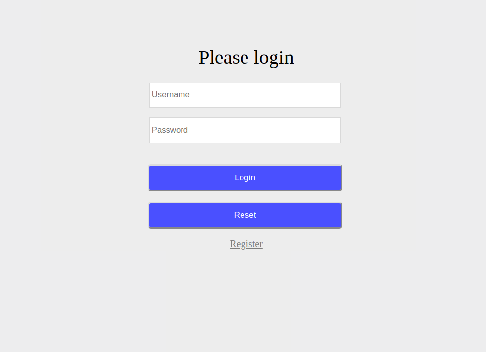
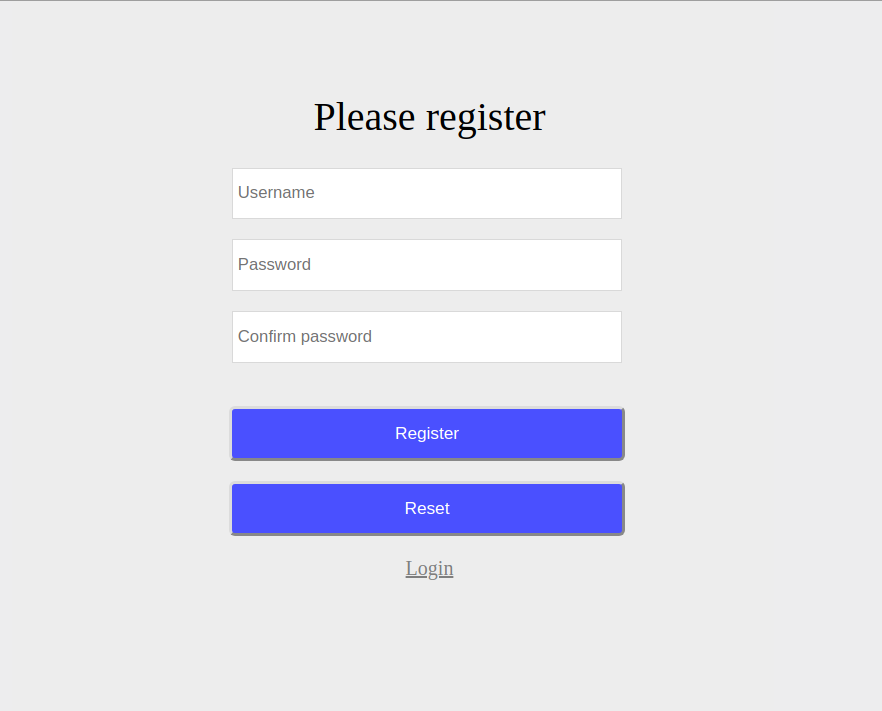
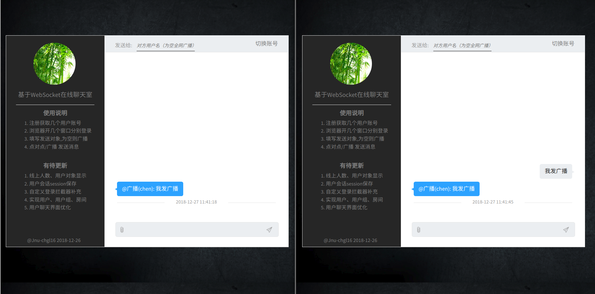
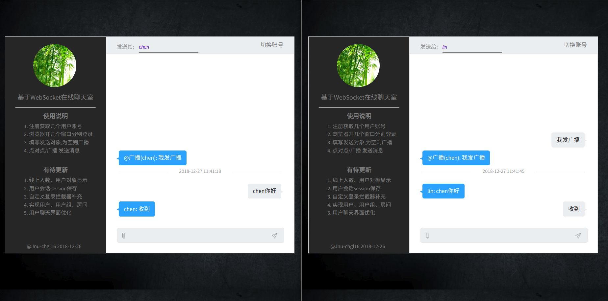

# chatroom
    基于WebSocket子协议STOMP实现的WEB端点对点实时聊天系统

<br>

## 开发环境
 


<br>

## 启动项目
    开发环境8080端口，线上环境9999端口

```xml
mvn spring-boot:run 
```
 或者
```xml
mvn clean package
java -jar target/*.jar
```

服务器
```xml
java -jar *.jar > log 2>&1 & 
```

<br>

## 效果预览

<hr>


<hr>


<hr>


<hr>



## 关键实现
1. 注册一个WebSocket
```java
@Configuration
@EnableWebSocketMessageBroker
public class WebSocketConfig implements WebSocketMessageBrokerConfigurer {
    @Override
    public void registerStompEndpoints(StompEndpointRegistry stompEndpointRegistry) {
        // 添加一个名为 "/endpointChat" 的基于STOMP子协议的节点（即服务器端socket）
        stompEndpointRegistry.addEndpoint("/endpointChat").withSockJS();
    }
}
```
2. 自定义数据库方式认证
```java
@Service
public class CustomUserService implements UserDetailsService {
    private static final Log log = LogFactory.getLog(CustomUserService.class);

    @Autowired
    private UserMapper userMapper;

    /**
     * 重写 loadUserByUsername 方法获取 userDetails 类型用户
     * SysUser 已经实现 UserDetails
     *
     * @param username
     * @return
     * @throws UsernameNotFoundException
     */
    @Override
    public UserDetails loadUserByUsername(String username) throws UsernameNotFoundException {
        SysUser user = userMapper.findByUsername(username);
        if (user != null) {
            log.info("username存在");
            log.info("打印: " + user);

            // 用户权限
            List<SimpleGrantedAuthority> authorities = new ArrayList<>();
            //用于添加用户的权限。只要把用户权限添加到authorities[本项目固定是用户角色]
            authorities.add(new SimpleGrantedAuthority("ROLE_USER"));

            return new org.springframework.security.core.userdetails.User(user.getUsername(),
                    user.getPassword(), authorities);
        } else {
            throw new UsernameNotFoundException("admin: " + username + " do not exist!");
        }
    }
}
```
3. WebSecurityConfig中配置数据库认证授权
```java
@Configuration
@EnableWebSecurity
public class WebSecurityConfig extends WebSecurityConfigurerAdapter {
    @Bean
    UserDetailsService myCustomUserService() {
        return new CustomUserService();
    }

    @Override
    protected void configure(AuthenticationManagerBuilder auth) throws Exception {
        auth.userDetailsService(myCustomUserService());
    }
    ....
}
```
4. 前端socket连接订阅
```javascript
var sock = new SockJS("/chatroom/endpointChat");
var stomp = Stomp.over(sock);
stomp.connect('guest', 'guest', function (frame) {
    stomp.subscribe("/user/notification", showGetMsg);
});
```
5. 消息发送
```javascript
stomp.send("/chat", {}, JSON.stringify({"text": text, "receiver": receiver}));
```
6. 服务器相应转发
```java
@MessageMapping(value = "/chat")
public void handleChat(Principal principal, Message message) {
    if (message.getReceiver().equals("")) {
        log.info("不填接收者，这是广播");
        simpMessagingTemplate.convertAndSendToUser("", "/notification", "@广播(" + principal.getName() + "): " + message.getText());
    } else {
        simpMessagingTemplate.convertAndSendToUser(message.getReceiver(), "/notification", principal.getName() + ": " + message.getText());
    }
}
```

## 有待更新
1. 登录login后的请求都交付Spring Security处理了，中间没有做拦截，因此登录成功后无法获取个人信息
2. 用户回话session保持功能没有实现
3. 聊天界面信息现象、分组、房间等功能有待添加优化


## 问题博客
    开发中遇到的问题在CSDN博客上记录了些
1. [spring Boot配置开发、线上环境](https://blog.csdn.net/chenbetter1996/article/details/85071430)
2. [Spring Security 5禁止明文、加密问题](https://blog.csdn.net/chenbetter1996/article/details/85080790)
3. [Spring Boot结合Thymeleaf静态资源拦截](https://blog.csdn.net/chenbetter1996/article/details/85092531)
4. [Spring Boot 2.0新版配置虚拟访问路径](https://blog.csdn.net/chenbetter1996/article/details/85268748)
5. [jar包服务器常驻后台执行](https://blog.csdn.net/chenbetter1996/article/details/85274988)